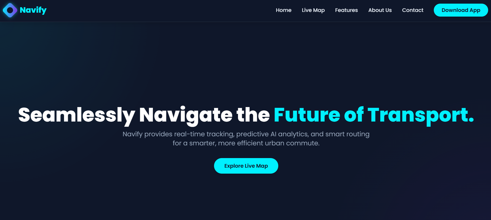

# Transport-tracker
Navify helps users track buses , predict delays , suggest alternate routes , and improve safety and efficiency in city travel . 

## Features

- *Real-time Bus Tracking:* See buses moving live on the map.
- *ETA for Upcoming Buses:* Know when the next bus will arrive.
- *Alerts for Delays:* Get notifications if a bus is delayed.
- *Alternative Routes:* Find the shortest route to save time and fuel.
- *User-friendly Interface:* Easy-to-use UI for all age groups.

- 
- 
- 
- 

---

## Tech Stack

- *Frontend:* HTML, CSS, JavaScript  
- *UI Framework:* Tailwind 
- *Maps & Tracking:* Leaflet.js (or any mapping library you used)  

---

## Live Demo
Check out the live site here: [Navify](https://sankalphq.github.io/Transport-tracker/)

